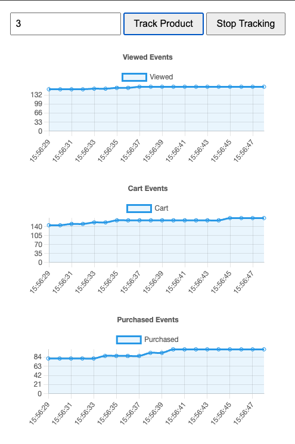

# Real-Time Product Event Analytics System

This project implements a real-time analytics system for tracking and visualizing e-commerce product events using a Lambda Architecture approach.

## System Overview

For the real time architecture I used Apache Spark Structured Streaming to process the events in real-time and store the results in PostgreSQL.

Events are generated by an event loop -> Kafka -> Spark Structured Streaming -> PostgreSQL -> Dashboard

* Batch to happen later:

The system tracks three types of product events:
- Product Views
- Add to Cart Actions
- Purchases

# How to run the project

1. Run `docker compose up` to start the Kafka, PostgreSQL, and API services
2. Run `./run.sh` to start the Spark application
3. Open the dashboard at http://localhost:5001
4. Enter a product ID between 1 and 5 in the input field
5. Click "Track Product" to start monitoring
6. The charts will automatically update every second
7. Click "Stop Tracking" to end monitoring

PGAdmin exposed at http://localhost:5050/

akhq exposed at http://localhost:8080/ to view topics.

Dashboard:

